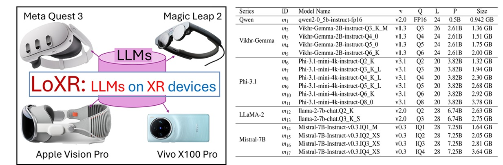

# **LoXR: Performance Evaluation of Locally Executing LLMs on XR Devices**  


## 🏆 **Acknowledgment**
LoXR is built upon **[`llama.cpp`](https://github.com/ggml-org/llama.cpp)**.  [`llama.cpp`](https://github.com/ggml-org/llama.cpp) is an excellent C++ implementation for running LLMs efficiently on various hardware. 
We deployed **LLLMS** locally on **XR devices** by customizing the **[`llama.cpp`](https://github.com/ggml-org/llama.cpp)** for four different XR devices. 

## 🚀 **Overview**  

**LoXR** is a framework for deploying and benchmarking **Large Language Models (LLMs) on XR devices**. It enables **on-device execution** of LLMs and provides tools for **performance analysis** across different XR platforms including:  

-  **Apple Vision Pro**  
-  **Magic Leap 2**  
- **Vivo X100 Pro**  
-  **Meta Quest 3**  

---


## 🎥 **LoXR Video Demo**
[LoXR Video](https://www.youtube.com/watch?v=dGmjYDRkdug)  
 ---

## 🔥 Script for the the Key Tests, including:  

✅ **Prompt Processing Test** – Measures the efficiency of input processing.  
✅ **Token Generation Test** – Evaluates LLM inference speed in tokens per second.  
✅ **Batch Test & Thread Test** – Analyzes the impact of batch sizes and thread configurations.  
✅ **Battery & Memory Consumption Analysis** – Tracks resource utilization on XR devices.  

---


## 🛠️ **Installation**  

Clone the repository and install dependencies:

```bash
git clone https://github.com/nanovis/LoXR.git
cd LoXR


## Publications

  Dawar Khan, Liu, Xinyu and Mena, Omar and Jia, Donggang and Kouyoumdjian, Alexandre and Viola, Ivan, <i>"LoXR: Performance Evaluation of Locally Executing LLMs on XR Devices"</i>, [arxiv.org preprint](https://arxiv.org/tba).

If you find our work useful, please consider citing our paper:
```bibtex


@article{LoXR2025,
  title        = {LoXR: Performance Evaluation of Locally Executing LLMs on XR Devices},
  author       = {Khan, Dawar and Liu, Xinyu and Mena, Omar and Jia, Donggang and Kouyoumdjian, Alexandre and Viola, Ivan},
  year         = 2025,
  journal      = {arxiv.org preprint },
}

@article{LoXR2025b,
  title        = {LLMs on XR (LoXR): Performance Evaluation of LLMs Executed Locally on Extended Reality Devices},
  author       = {Liu, Xinyu and Khan, Dawar and  Mena, Omar and Jia, Donggang and Kouyoumdjian, Alexandre and Viola, Ivan},
  year         = 2025,
  journal      = {IEEE VR 2025 Posters (accepted)},
}
